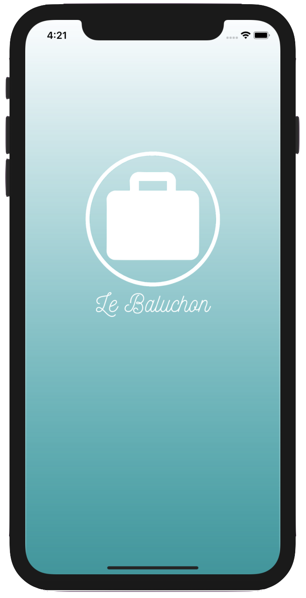
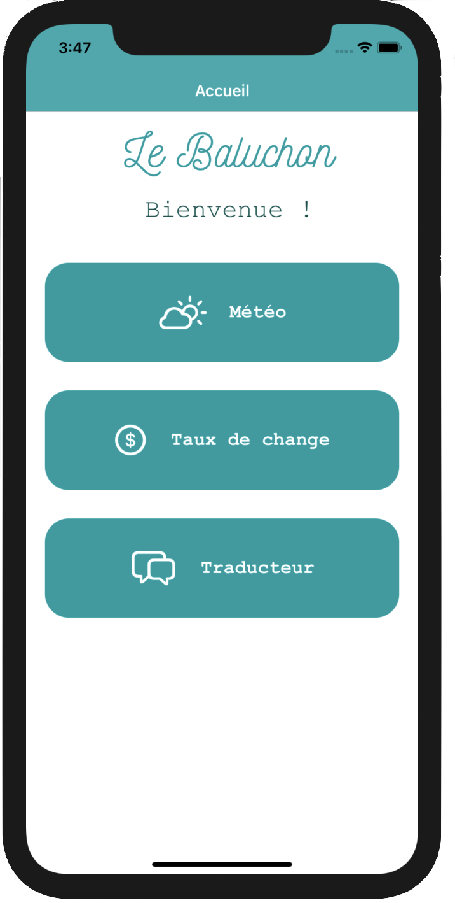
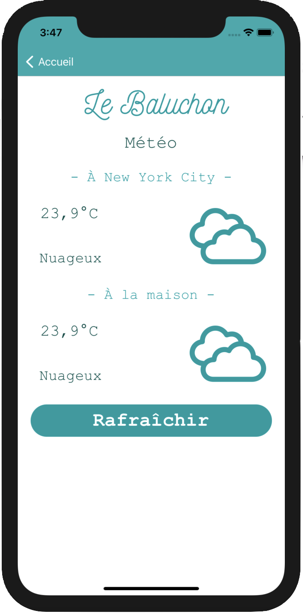
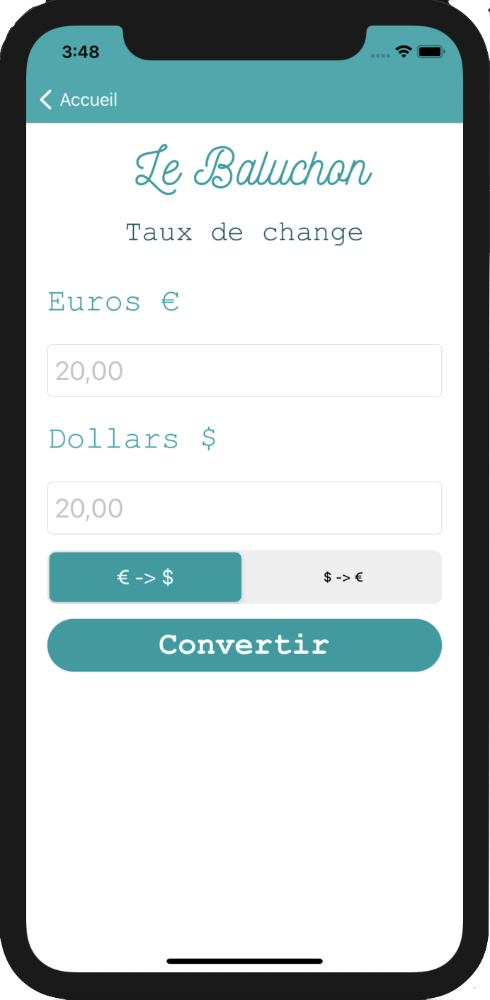
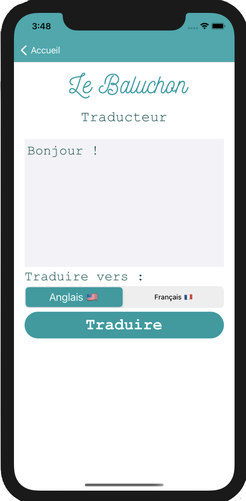

# Le Baluchon

**Le Baluchon** is a multi-pages iOS New York City travel application that contains a weather page, change rate page and translator page.

 

## Version

Current version : V2.
Language : French
Supports iOS 14.1+. 
Available in portrait mode on iPhone.
**Unit tests : ✓**

## APIs

- Weather :
[OpenWeatherMap](https://openweathermap.org/api)

- Change rate :
[Fixer.io](https://fixer.io)

- Translator :
[Google Translate API](https://cloud.google.com/translate/?hl=fr&utm_source=google&utm_medium=cpc&utm_campaign=emea-fr-all-fr-dr-bkws-all-all-trial-e-gcp-1011340&utm_content=text-ad-none-any-DEV_c-CRE_253501207381-ADGP_Hybrid%20%7C%20BKWS%20-%20EXA%20%7C%20Txt%20~%20AI%20%26%20ML%20~%20Cloud%20Translation%23v4-KWID_43700053286941141-kwd-14329410560-userloc_9056177&utm_term=KW_google%20translate%20api-NET_g-PLAC_&gclid=CjwKCAjw9LSSBhBsEiwAKtf0n3tmfSLh4d6Pdgvh-YqvL6IRpFKwOspPBR5P6FS5-AoSaGw_S_qEphoCVaYQAvD_BwE&gclsrc=aw.ds)

# Functionalities

- [x] See current weather in New York City and Nemours (France) to compare both

- [x] Convert dollars to euros ($ -> €) and euros to dollars (€ -> $) (change rate is updated daily)

- [x] Translate text from French to English (🇫🇷 -> 🇺🇸), and from English to French (🇺🇸 -> 🇫🇷)

# Home

When opening the application, user is greeted by the home page, where it is possible to access Weather page, Change Rate page and Translator page.

# Weather

When 'Météo' button is tapped, the user access the page where the current weather in New York City, USA and in Nemours, France, is displayed.

# Change Rate

When 'Taux de change' button is tapped, the user access the change rate page, where they can convert dollar amounts to euro, and euro to dollar.

# Translator

When 'Traducteur' button is tapped, the user access the translator page, where they can enter a text in French and translate it in English, or enter a text in English and translate it to French.

> Written with [StackEdit](https://stackedit.io/).
